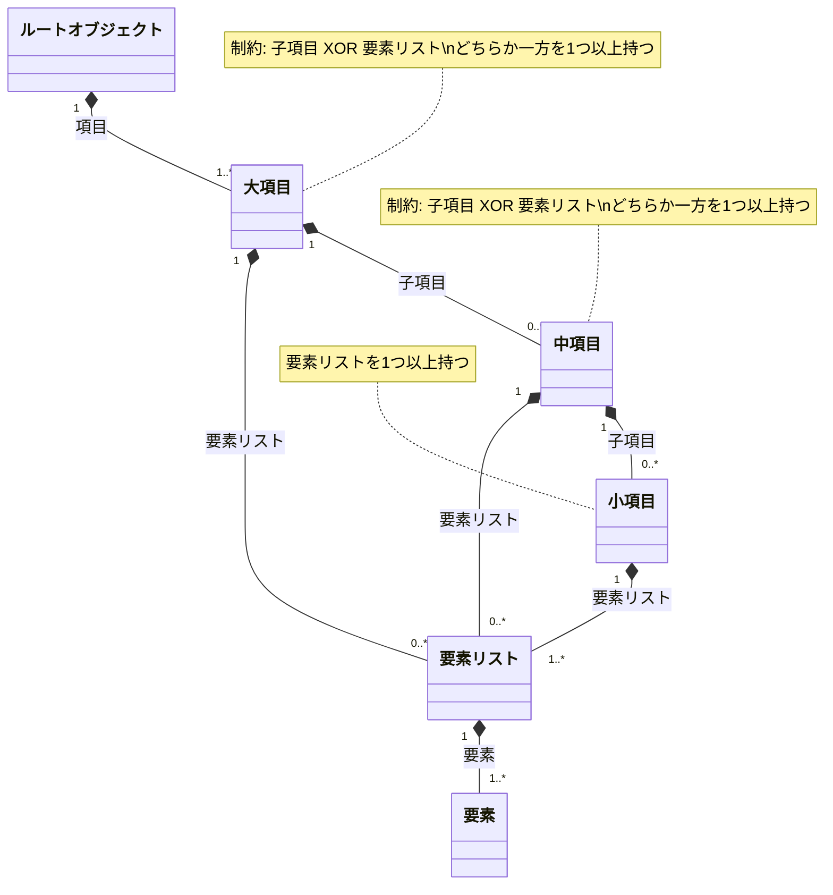

# SpecNote

## 概要

- 製品スペック編集ツール
- ツリー状の「項目名」+「要素」データを作成。
- 項目の構造も編集していくため、構造エディタも兼ねる。
- 作成したデータはJSONとして書き出す。
- 「要素」をすべて消去し、項目の構造のみをJSONで書き出し、テンプレートとしても活用できる。
- JSONをインポートして再編集可能。

## 背景

- 各製品が担当者ごとにバラバラのフォーマットのWordファイルで製品仕様書を作成しており、下流工程(Webページやパンフレット、ユーザー向けの資料作成など)での利活用にコストがかかっている。
- 定められたフォーマットのJSONとして作成し、下流工程での生産性を上げたい。
- JSONを直接編集するのは製品開発部門にとって負担であるため、本ツールにより作成不可を軽減する。

## 機能仕様

### 追加/削除ボタン

- 項目の追加、項目への子項目の追加、項目への要素リストの追加、要素リストへの要素の追加および項目の削除、要素の削除をおこなう。
- それぞれ「+」「-」をアイコンとする。
- 親項目を削除した際は子項目、子要素も削除される。

### 項目

- 項目名を文字列として持つ。
  - 半角、全角スペースではなく何らかの文字必須。
  - 同じ親要素内の同じレベル内でユニーク。
- 3段まで入れ子可能。
  - 大項目
  - 中項目
  - 小項目
- 大項目、中項目には子項目追加用と要素リスト追加用の追加ボタンが付く。
- 小項目は要素リスト追加用の追加ボタンのみ付く。
- それぞれのレベルの末尾の項目に同レベルの項目追加ボタンが付く。
- 要素リストの末尾の要素にも要素追加ボタンが付く。
- ドラッグドロップで項目の順序を入れ替え可能。
  - ただし、子項目はその親項目の範囲内のみ移動可能。

### 要素リスト

- 可変長のスペック値を格納するためのリスト。
  - 例：「接続端子」項目に「DisplayPort」「HDMI」「D-Sub」の3つを持つ等。
- 場合分けを想定し、各項目に可変長個の要素リストを持つことができる。
- 要素リストが複数になる場合はそれぞれのリストにラベル(文字列)を付ける。
  - 例: 「チルト角」の項目が、製品バリエーションAが「30°」、製品バリエーションBが「15 - 60°」の要な場合、ラベルに「バリエーションA」「バリエーションB」と記載。

### 要素

- 項目に紐づくスペック値。
- 要素はあらかじめ定められた要素型のいずれかから選択する。
- 要素リスト内で型は同一。
- 型は要素リスト追加時にあらかじめ定められた型から選択。
- 同時に単位文字列を設定する。
- 実数型については小数点以下の桁数も設定する。

## 詳細仕様

### データ構造



### 要素型

- 文字列: 1つのテキストフィールド。
- 整数: 1つのテキストフィールド。整数のみ入力可。
- 実数: 1つのテキストフィールド。整数とピリオドのみ入力可。

## 開発

```bash
npm install
npm run dev
```

本番ビルドは次のコマンドで実行します。

```bash
npm run build
```

## JSON形式

ルートの `items` 配列に大項目を格納します。各項目は `name`、`children`、`elementLists` を持ち、要素リストは `label`、`type`、`unit`、`precision`、`elements` を持ちます。

- `type`: `string`、`integer`、`number`
- JSONは2スペースで整形し、アプリ内部のIDは出力しません
- テンプレートJSONでは要素配列を空にします
